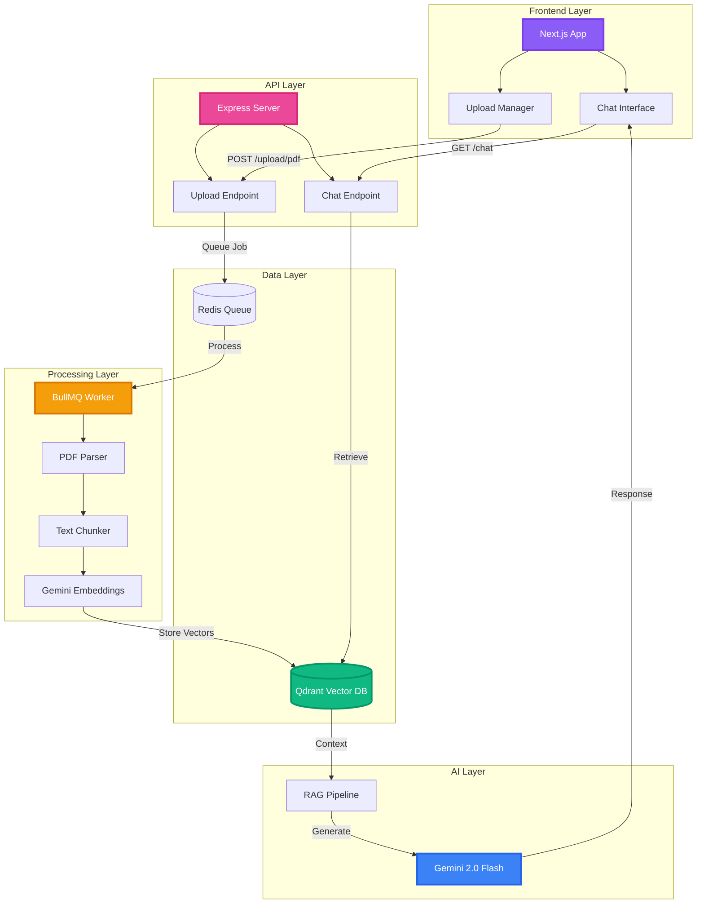

<div align="center">

# 🚀 RAG PDF Intelligence

### *Transform Your Documents into Interactive Knowledge*

<p align="center">
  <strong>A Production-Ready Retrieval-Augmented Generation System</strong>
  <br/>
  Built with LangChain • Qdrant • Next.js • Google Gemini
</p>

<p align="center">
  
  
  
  
</p>

<p align="center">
  
  
  
  
</p>

<p align="center">
  
  
  
</p>

---

### ✨ Features at a Glance

```
🎯 Smart PDF Processing    📊 Vector Embeddings      💬 Intelligent Chat
🔄 Real-time Updates       🎨 Modern UI/UX          ⚡ Lightning Fast
🐳 Docker Ready           🔒 Production Grade       📱 Responsive Design
```

</div>

---

## 🌟 What Makes This Special?

<table>
<tr>
<td width="50%">

### 🧠 **Intelligent Document Understanding**
Upload any PDF and instantly create a searchable knowledge base. Our RAG system doesn't just search—it **understands context** and provides accurate, grounded answers.

</td>
<td width="50%">

### ⚡ **Production-Ready Architecture**
Built with scalability in mind. Asynchronous job processing, vector search optimization, and containerized deployment make this ready for real-world use.

</td>
</tr>
<tr>
<td width="50%">

### 🎨 **Beautiful Modern Interface**
Stunning glass-morphism UI with smooth animations, drag-and-drop uploads, and an intuitive chat experience powered by Framer Motion.

</td>
<td width="50%">

### 🔧 **Developer Friendly**
Clean code architecture, comprehensive error handling, environment-based configuration, and full Docker Compose setup for one-command deployment.

</td>
</tr>
</table>

---

## 🏗️ System Architecture



---

## 🎯 Core Features

<details open>
<summary><b>📄 PDF Processing Pipeline</b></summary>

- **Intelligent Chunking** - Smart text splitting with overlap for context preservation
- **Embedding Generation** - Google's latest text-embedding-004 model
- **Vector Storage** - High-performance Qdrant vector database
- **Asynchronous Processing** - BullMQ job queue for scalable document handling
- **Error Recovery** - Robust retry mechanisms and failure handling

</details>

<details open>
<summary><b>💬 Conversational AI</b></summary>

- **Context-Aware Responses** - Gemini 2.0 Flash with RAG retrieval
- **Source Attribution** - Answers grounded in your documents
- **Multi-turn Conversations** - Maintains context across chat sessions
- **Real-time Streaming** - Instant response generation
- **Error Boundaries** - Graceful degradation and user feedback

</details>

<details open>
<summary><b>🎨 Modern Frontend</b></summary>

- **Glass Morphism Design** - Beautiful frosted glass effects
- **Smooth Animations** - Framer Motion powered transitions
- **Drag & Drop Upload** - Intuitive file management
- **Real-time Status** - Live upload and processing feedback
- **Responsive Layout** - Perfect on desktop, tablet, and mobile
- **Dark Mode Optimized** - Eye-friendly interface

</details>

<details open>
<summary><b>🐳 DevOps & Deployment</b></summary>

- **Docker Compose** - Complete stack in one command
- **Environment Config** - Secure credential management
- **Service Orchestration** - Qdrant, Redis, Server, Worker coordination
- **Health Checks** - Automatic service monitoring
- **Volume Persistence** - Data retention across restarts

</details>

---

## 🛠️ Technology Stack

### **Frontend**
- **Framework:** Next.js 15 with App Router & Turbopack
- **UI Library:** React 19 with TypeScript
- **Styling:** Tailwind CSS 4 with custom glass-morphism
- **Animations:** Framer Motion for smooth transitions
- **Icons:** Lucide React
- **Components:** Radix UI primitives

### **Backend**
- **Runtime:** Node.js 20+ with Express.js
- **Queue:** BullMQ with Redis
- **File Upload:** Multer for multipart/form-data
- **API:** RESTful endpoints with CORS

### **AI & ML**
- **LLM:** Google Gemini 2.0 Flash
- **Embeddings:** text-embedding-004 (768 dimensions)
- **Framework:** LangChain.js
- **Vector DB:** Qdrant (cosine similarity)
- **PDF Parsing:** PDF.js via LangChain loaders

### **Infrastructure**
- **Containerization:** Docker & Docker Compose
- **Message Queue:** Redis 7
- **Vector Database:** Qdrant latest
- **Process Management:** BullMQ workers

---

## 🚀 Quick Start

### **Prerequisites**

```bash
Node.js >= 20.0.0
Docker & Docker Compose
Google API Key (Gemini)
```

### **1. Clone the Repository**

```bash
git clone https://github.com/sharjil100/Rag-PDF-APP.git
cd Rag-PDF-APP
```

### **2. Environment Setup**

Create a `.env` file in the root directory:

```env
# Google Gemini API
GOOGLE_API_KEY=your_gemini_api_key_here

# Redis Configuration
REDIS_HOST=localhost
REDIS_PORT=6379

# Qdrant Configuration
QDRANT_URL=http://localhost:6333
QDRANT_COLLECTION=langchainjs-gemini-embeddings

# Server Configuration
PORT=8000
NODE_ENV=development
```

### **3. Install Dependencies**

```bash
# Install server dependencies
npm install

# Install client dependencies
cd client
npm install
cd ..
```

### **4. Start Infrastructure Services**

```bash
# Start Qdrant and Redis using Docker Compose
docker-compose up -d qdrant redis
```

### **5. Run the Application**

**Terminal 1 - Backend Server:**
```bash
npm run dev
# Server runs on http://localhost:8000
```

**Terminal 2 - Worker Process:**
```bash
npm run worker
# Worker processes PDF upload jobs
```

**Terminal 3 - Frontend:**
```bash
cd client
npm run dev
# Client runs on http://localhost:3000
```

### **6. Access the Application**

Open your browser and navigate to:
```
http://localhost:3000
```

---

## 📖 Usage Guide

### **Uploading PDFs**

1. **Drag & Drop** - Simply drag PDF files into the upload zone
2. **Click to Upload** - Or click the upload area to browse files
3. **Monitor Progress** - Watch real-time upload and processing status
4. **Wait for Processing** - Worker extracts and indexes content

### **Chatting with Documents**

1. **Ask Questions** - Type any question about your uploaded PDFs
2. **Get Context-Aware Answers** - AI retrieves relevant chunks and generates responses
3. **View Sources** - See which document sections were used
4. **Continue Conversation** - Ask follow-up questions naturally

---

## 🏗️ Project Structure

```
RAG-PDF-APP/
├── 📁 client/                    # Next.js Frontend
│   ├── 📁 app/
│   │   ├── 📁 components/       # React components
│   │   │   └── chat.tsx         # Main chat interface
│   │   ├── layout.tsx           # Root layout
│   │   ├── page.tsx             # Home page with upload
│   │   └── globals.css          # Global styles
│   ├── 📁 components/ui/        # Reusable UI components
│   │   ├── button.tsx
│   │   └── input.tsx
│   └── 📁 lib/
│       └── utils.ts             # Utility functions
├── 📁 server/
│   ├── index.js                 # Express API server
│   ├── worker.js                # BullMQ PDF processor
│   ├── package.json
│   └── 📁 uploads/              # Temporary PDF storage
├── docker-compose.yml           # Service orchestration
├── .env                         # Environment variables
├── .gitignore                   # Git ignore rules
└── README.md                    # This file
```

---

## 🔧 API Endpoints

### **Upload PDF**
```http
POST /upload/pdf
Content-Type: multipart/form-data

Body:
  pdf: <file>

Response:
{
  "message": "PDF uploaded successfully",
  "queued": true
}
```

### **Chat Query**
```http
GET /chat?message=<your_question>

Response:
{
  "message": "AI generated answer based on your PDFs",
  "docs": [
    {
      "pageContent": "Relevant text chunk...",
      "metadata": { "source": "filename.pdf" }
    }
  ]
}
```

### **Health Check**
```http
GET /

Response:
{
  "Status": "All Good!!"
}
```

---

## 🐳 Docker Deployment

### **Full Stack with Docker Compose**

```bash
# Start all services
docker-compose up -d

# View logs
docker-compose logs -f

# Stop all services
docker-compose down

# Stop and remove volumes
docker-compose down -v
```

### **Services Included**

| Service | Port | Description |
|---------|------|-------------|
| Qdrant | 6333 | Vector database for embeddings |
| Redis | 6379 | Message queue for job processing |
| Server | 8000 | API backend (manual start) |
| Worker | - | Background PDF processor (manual start) |
| Client | 3000 | Next.js frontend (manual start) |

---

## ⚙️ Configuration

### **Qdrant Collection Settings**

```javascript
{
  collection: "langchainjs-gemini-embeddings",
  vectorSize: 768,
  distance: "Cosine"
}
```

### **PDF Processing Settings**

```javascript
{
  chunkSize: 1000,
  chunkOverlap: 200,
  separator: "\n\n"
}
```

### **Retrieval Settings**

```javascript
{
  k: 2,  // Number of relevant chunks to retrieve
  taskType: "RETRIEVAL_QUERY"
}
```

---

## 🎨 UI Components

### **Glass Morphism Effects**
```css
.glass-morphism {
  background: rgba(15, 23, 42, 0.6);
  backdrop-filter: blur(10px);
  -webkit-backdrop-filter: blur(10px);
}
```

### **Gradient Text**
```css
.text-gradient {
  background: linear-gradient(135deg, #a855f7, #ec4899);
  -webkit-background-clip: text;
  -webkit-text-fill-color: transparent;
}
```

---

## 🧪 Testing

```bash
# Test PDF upload
curl -X POST http://localhost:8000/upload/pdf \
  -F "pdf=@test.pdf"

# Test chat query
curl "http://localhost:8000/chat?message=What%20is%20this%20document%20about?"

# Check health
curl http://localhost:8000/
```

---

## 🔐 Security Best Practices

- ✅ **API Keys** - Stored in `.env`, never committed
- ✅ **CORS** - Configured for specific origins
- ✅ **File Validation** - Only PDF files accepted
- ✅ **Upload Limits** - File size restrictions
- ✅ **Gitignore** - Uploads and sensitive files excluded

---

## 🚧 Roadmap

- [ ] User authentication and session management
- [ ] Multi-user document isolation
- [ ] Advanced filtering and search
- [ ] Export chat history
- [ ] Support for multiple file formats (DOCX, TXT, etc.)
- [ ] Streaming responses in chat
- [ ] Conversation memory and history
- [ ] Analytics dashboard
- [ ] Kubernetes deployment configs
- [ ] CI/CD pipeline

---

## 🤝 Contributing

Contributions are welcome! Please feel free to submit a Pull Request.

1. Fork the repository
2. Create your feature branch (`git checkout -b feature/AmazingFeature`)
3. Commit your changes (`git commit -m 'Add some AmazingFeature'`)
4. Push to the branch (`git push origin feature/AmazingFeature`)
5. Open a Pull Request

---

## 📝 License

This project is licensed under the MIT License - see the [LICENSE](LICENSE) file for details.

---

## 🙏 Acknowledgments

- **LangChain.js** - For the powerful RAG framework
- **Qdrant** - For blazing-fast vector search
- **Google Gemini** - For state-of-the-art AI capabilities
- **Vercel** - For Next.js and hosting platform
- **shadcn/ui** - For beautiful UI components

---

## 📞 Contact & Support

**Author:** Sharjil  
**GitHub:** [@sharjil100](https://github.com/sharjil100)  
**Repository:** [Rag-PDF-APP](https://github.com/sharjil100/Rag-PDF-APP)

---

<div align="center">

### ⭐ Star this repo if you find it useful!

**Made with ❤️ and ☕ by Sharjil**

</div>
